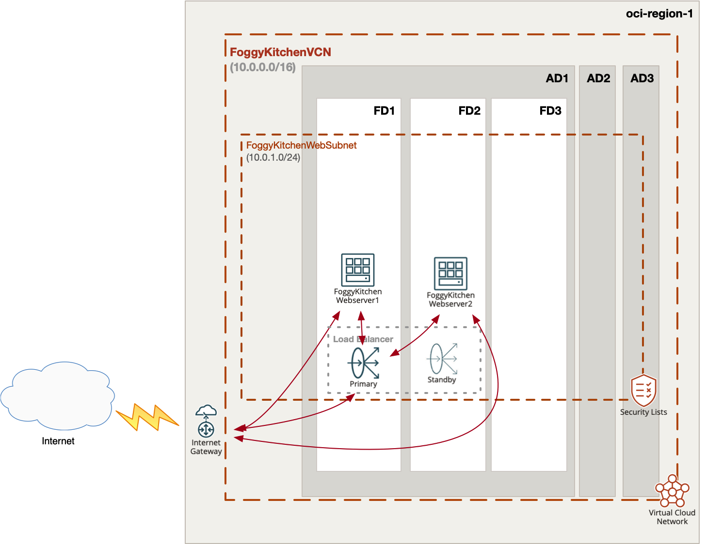

# FoggyKitchen Terraform OCI Course

## LESSON 3 - Load Balancer

In this lesson, we will introduce the OCI Public Load Balancer. Load Balancer's Listener entity will be visible on the Internet, which means you will have an additional public IP address. On the other hand Load Balancer's Backendset with Backends will be associated with both Webserver VMs. The outcome of this training is very simple. You can access web servers via the Load Balancer. Reload webpage a couple of times and you should expect index.html page to be different depends on what web server has been chosen by the Load Balancer. There is only one drawback of this configuration. Webservers are still visible with their public IPs. Wouldn't it be great to hide them? 



## Deploy Using Oracle Resource Manager

1. Click [](https://cloud.oracle.com/resourcemanager/stacks/create?region=home&zipUrl=https://github.com/mlinxfeld/foggykitchen_tf_oci_course/raw/master/LESSON3_load_balancer/resource-manager/LESSON3_load_balancer.zip)

    If you aren't already signed in, when prompted, enter the tenancy and user credentials.

2. Review and accept the terms and conditions.

3. Select the region where you want to deploy the stack.

4. Follow the on-screen prompts and instructions to create the stack.

5. After creating the stack, click **Terraform Actions**, and select **Plan**.

6. Wait for the job to be completed, and review the plan.

    To make any changes, return to the Stack Details page, click **Edit Stack**, and make the required changes. Then, run the **Plan** action again.

7. If no further changes are necessary, return to the Stack Details page, click **Terraform Actions**, and select **Apply**. 

## Deploy Using the Terraform CLI

### Clone of the repo
Now, you'll want a local copy of this repo. You can make that with the commands:

Clone the repo from github by executing the command as follows and then go to proper subdirectory:

```
Martin-MacBook-Pro:~ martinlinxfeld$ git clone https://github.com/mlinxfeld/foggykitchen_tf_oci_course.git

Martin-MacBook-Pro:~ martinlinxfeld$ cd foggykitchen_tf_oci_course/

Martin-MacBook-Pro:foggykitchen_tf_oci_course martinlinxfeld$ cd LESSON3_load_balancer

```

### Prerequisites
Create environment file with TF_VARs:

```
Martin-MacBook-Pro:LESSON3_load_balancer martinlinxfeld$ vi setup_oci_tf_vars.sh

export TF_VAR_user_ocid="ocid1.user.oc1..aaaaaaaaob4qbf2(...)uunizjie4his4vgh3jx5jxa"
export TF_VAR_tenancy_ocid="ocid1.tenancy.oc1..aaaaaaaas(...)krj2s3gdbz7d2heqzzxn7pe64ksbia"
export TF_VAR_compartment_ocid="ocid1.tenancy.oc1..aaaaaaaasbktyckn(...)ldkrj2s3gdbz7d2heqzzxn7pe64ksbia"
export TF_VAR_fingerprint="00:f9:d1:41:bb:57(...)82:47:e6:00"
export TF_VAR_private_key_path="/tmp/oci_api_key.pem"
export TF_VAR_region="eu-amsterdam-1"

Martin-MacBook-Pro:LESSON3_load_balancer martinlinxfeld$ source setup_oci_tf_vars.sh
```

### Create the Resources
Run the following commands:

```
Martin-MacBook-Pro:LESSON3_load_balancer martinlinxfeld$ terraform init
    
Martin-MacBook-Pro:LESSON3_load_balancer martinlinxfeld$ terraform plan

Martin-MacBook-Pro:LESSON3_load_balancer martinlinxfeld$ terraform apply
```

### Destroy the Deployment
When you no longer need the deployment, you can run this command to destroy the resources:

```
Martin-MacBook-Pro:LESSON3_load_balancer martinlinxfeld$ terraform destroy
```
